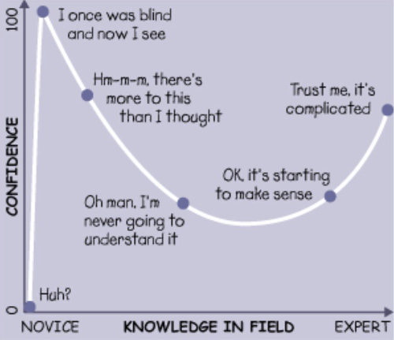
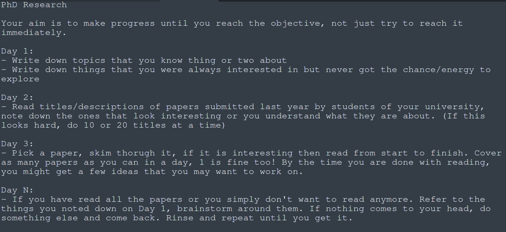

## Introduction

Hacking is the art of using things in unintended ways. For example, if a software's trial is about to expire, you might be able to extend it by changing your computer's date to the previous week. That's hacking.

There's no 'one right way' to learn hacking, all ways are right ways. That's why the purpose of this guide is to provide a direction rather than a roadmap. It may sound preachy/cringy in parts like the first sentence of this paragraph, sorry about that.

If there's something you think should be added/improved, please [create an issue](https://github.com/s0md3v/be-a-hacker/issues/new).

## Contents
- [Origin of hacking](https://github.com/s0md3v/be-a-hacker#origin-of-hacking)
- [Basic principles](https://github.com/s0md3v/be-a-hacker#basic-principles)
    - [Learn how stuff works](https://github.com/s0md3v/be-a-hacker#learn-how-stuff-works)
    - [Sharing is cool](https://github.com/s0md3v/be-a-hacker#sharing-is-cool)
    - [Don't be a rockstar](https://github.com/s0md3v/be-a-hacker#dont-be-a-rockstar)
    - [Do cool shit](https://github.com/s0md3v/be-a-hacker#do-cool-shit)
- [The roadmap](https://github.com/s0md3v/be-a-hacker#the-roadmap)
    - [Getting started](https://github.com/s0md3v/be-a-hacker#getting-started)
        - [Basics of computer science](https://github.com/s0md3v/be-a-hacker#basics-of-computer-science)
        - [Network basics](https://github.com/s0md3v/be-a-hacker#network-basics)
        - [Get familiar with terminal](https://github.com/s0md3v/be-a-hacker#get-familiar-with-terminal)
        - [Programming](https://github.com/s0md3v/be-a-hacker#programming)
        - [Basic hacking concepts](https://github.com/s0md3v/be-a-hacker#basic-hacking-concepts)
    - [What's next?](https://github.com/s0md3v/be-a-hacker#whats-next)
- [FAQ](https://github.com/s0md3v/be-a-hacker#faq)
    - [How do I earn money?](https://github.com/s0md3v/be-a-hacker#how-do-i-earn-money)
    - [I know nothing, I have no skills.](https://github.com/s0md3v/be-a-hacker#i-think-i-know-nothing-i-have-no-skills)
    - [How to avoid burnouts?](https://github.com/s0md3v/be-a-hacker#how-to-avoid-burnouts)
    - [I want to do great and innovative things.](https://github.com/s0md3v/be-a-hacker#i-want-to-do-great-and-innovative-things)
    - [How do I become social and confident?](https://github.com/s0md3v/be-a-hacker#how-do-i-become-social-and-confident)
    - [I want to do things but I end doing nothing all day](https://github.com/s0md3v/be-a-hacker#i-want-to-do-things-but-i-end-up-doing-nothing-all-day)

## Origin of hacking
I believe it is important to know your roots so let's talk about them without overanalyzing the origin.

In the 1960s, telephone networks used a set of sounds to process phone calls. A group of people figured out how it all worked and managed to reproduce the 2600Hz frequency sounds being used by these networks. How did they do it? By blowing into a whistle that came free with cereal. This act was called **phreaking** and the people who did it were called **phreaks**.

Denny Teresi, one of the phreaks said in an interview:
> "It wasn't just to rip off the telephone company, it was the technical challenge - if we will be able to do it."

They did it because it was a fascinating problem for them to solve and they wanted to see if they could solve it. This is exactly what hacking culture is, even today.

Learn more about phreaking - [How Telephone Phreaking Worked](https://www.youtube.com/watch?v=4tHyZdtXULw&t=16s)
## Basic principles

### Learn how stuff works
If you want to sell medicine, you will only need a place to store the medicine and hand over whatever a customer needs. On the other hand, if you want to create cures for diseases, you will need to know how the human body and everything works. Makes sense right? The same applies to hacking. If you want to get really good at hacking something and creating new techniques to do so, you must understand how it works.

### Sharing is cool
If you have some information that you think might be helpful for other people, share it through social media, forums, or blogs. It will benefit you in many ways:

1. You will be appreciated which will motivate you and put a smile on your face.
2. Any mistakes or improvements to be made in your content will be pointed out so the overall quality of it will increase.
3. You can only explain something if you understand it well which can be a self-check to see if you actually know enough about a topic.
4. Exposure is a great thing. It will bring you opportunities and the power to influence people for good.

### Don't be a 'rockstar'
A rockstar is a person who might be skilled but isn't a very good person to work/talk with. They often have a big ego, they like to work alone because they know* everything and they often look down on people. It doesn't essentially mean that they are bad people because this behavior can be both intentional and unintentional. The point is, they look bad doing so and more importantly, make others feel bad.\
To be honest, this is a common problem and I too once started to slip into this zone due to depression, it was not fun, that's why I have included it.

tl;dr: Don't be some egoistic genius sitting in a room.

### Do cool shit
Be curious, experiment a lot, build cool shit, that's the entire point, that's how it all started. If you spend your life using techniques and tools developed by other people, what's the point of choosing a cool path like this?

## The roadmap
The roadmap contains some good resources as well as some topics that you will need to google and read about yourself. This is not simply a 'step-by-step guide' or a collection of resources.

Read/watch stuff, note down the terms you don't understand, google them and learn about them from at least 3 different sources, again note down terms you don't understand and keep repeating the process.
Why at least 3 sources? Because the information provided by 1 creator will be limited to what they know, getting it from 3 different creators will give you a better understanding of the subject from different perspectives.

I will reference this methodology as 'recursive learning' throughout the guide.

### Getting started

Hacking has many fields e.g. reverse engineering, web hacking, car hacking, etc. but some things are helpful irrespective of the field so let's talk about them first.

#### Basics of Computer Science
It will help you get a deeper understanding of the machine you will be using for hours every day as well as to gain a valuable perspective that I can't really explain in words.

Remember, you just need to know the basics because this knowledge will keep being developed if you are curious by asking questions like "What happens when you delete a file? If they stay on the device, how does space get freed? If they are really gone, how do recovery software recover them?"

**Resources:**
  - [Crash Course](https://www.youtube.com/playlist?list=PL8dPuuaLjXtNlUrzyH5r6jN9ulIgZBpdo)'s CS playlist
  - [Computerphile](https://www.youtube.com/user/Computerphile) (not beginner-friendly)

#### Network basics
Understanding how the internet (and other networks) work, it's essential because networks are everywhere.

**Topics to start recursive learning:**
```
IP address, MAC address, port, client & server, dns, tcp, udp, proxy, tls/ssl, vpn
```
**Resources:**
  - [Network Fundamentals](https://www.youtube.com/watch?v=9uebakqWlB0)
  - [TCP/IP protocol explained](https://www.youtube.com/watch?v=e5DEVa9eSN0)
  - [How SSL works?](https://howhttps.works)

#### Get familiar with terminal
You will spend a lot of time in the terminal whether it is running programs or accessing remote servers. You can use any operating system but I suggest Linux-based operating systems simply because you can modify everything about it which is the essence of hacking. [Ubuntu](https://ubuntu.com/download/desktop) is a great linux distribution for beginners.

#### Programming
To understand how a given software works (makes it easy to hack it) and to create your own software for hacking and other tasks.

There are a lot of programming languages but I will suggest you to start with Python because it's easy and can do almost everything from creating a face detector to a website.

I have written an article about how to get started, [check it out](https://s0md3v.medium.com/learn-to-code-in-less-than-a-week-8f3da5e0ab29).

#### Basic hacking concepts
There are some concepts that you will find in every other cyber security-related article and they come in handy in most fields.

**Topics to start recursive learning:**
```
phishing, ddos and dos attack, website crawling, encoding and encryption, password cracking, login bruteforcing, man in the middle attack
```

## What's next?

If you have gone through all the basics, especially the basic hacking concepts, you might have developed an interest in some particular things already. If you haven't, I am mentioning some cyber security-related fields here, google the ones that catch your eye:

1. **Web hacking:** hacking websites
2. **Physical security:** Breaking into buildings (includes lockpicking and stuff)
3. **Malware analysis:** Analysing malware and writing it
5. **Digital forensics:** Investigating digital crime scenes e.g. a hacked computer
6. **OSINT:** Being an online detective
7. **Car hacking:** Hacking into cars (duh)
8. **Mobile hacking:** Hacking mobiles and mobile apps (duh x2)
9. **IoT hacking:** Hacking internet-connected devices e.g. cameras or smart doorbells
10. **Social engineering:** Manipulating people to extract information or hack their systems

Once you find what interests you the most, spend one-day doing research about how to get started and what are the best resources to do so. The next day, just get started and never stop learning, everything will fall into place.

Also, do these things:

- Start a blog, you can start by compiling all the knowledge about one topic from different sources into one article. Give credit tho.
- Start writing tools (they don't need to be open source)
- Become a part of communities
- When you have start getting a grip on your favorite subject, watch talks related to it. An archive can be found on [infocon.org](https://infocon.org).

## FAQ

### How do I earn money?
Not to hype you up but you can get rich in a day, legally.

**Do you have skills?**
Do bug bounties or submit vulnerabilities to platforms like [Zerodium](https://zerodium.com/).

**Do you have skills and some quality public work?**
Do freelancing or start applying for jobs.

### I am in school/college, how do I manage my time?
> Note: These instructions are only for those who have made up their mind about working in tech.

If you are in school, learn science and maths well. This knowledge is vital. Don't care too much about grades if getting admission in nearby college won't be difficult. Use the rest of your time to hang out with your friends, excercise and sharpen your skills. First 2 are not optional.

If you are in college, spend more time getting better at your tech stuff. You only need to pass the exams and get a degree; grades won't matter at all while finding a job. If you did all the 3 things I mentioned for school years - you will be a healthy, social and capable individual at this point. If you have already fucked up one or more of the 3, it's alright - you can fix that now but do it asap.

### I think I know nothing, I have no skills.
Okay, how did you come to this conclusion? Did you get this feedback from multiple recent interviews? Do you just don't understand a single word when two 'experts' of your field are talking?

or, do you just feel so? It's often just a feeling and it's actually an indicator that you are doing good. Dunning-Kruger effect explains it well:



### How to avoid burnouts?
Divide your day into 3 parts:

1. **Work:** Do stuff that you already know just for practice or to earn money with it.
2. **Learn:** Learn new things. This will give you a sense of progress which is very imporant to make sure your life doesn't feel repetitive.
3. **Have fun:** Most important, have fun. Go for a walk, watch a TV show or play games. Whatever works for you.

Burnouts happen when you either work for too long or work on the same thing for long. Making sure to learn new things and having fun every day will keep burnouts away.

### How do I become social and confident?
The thing that stops us from getting out of our comfort zone is that we are afraid that we will end up making a fool of ourselves. If this is you, read along.

We often end up thinking things like, what if the presentation I have worked so hard for, doesn't go right? What if I go and talk to this person and they don't like me or I mess up my words? What if I upload my real picture on the internet and everyone finds me ugly?\
The truth is, nobody cares. People trip while walking all the time, forget important things, mess up their words etc. Why do you think you are so important that people will make a big deal out of your mistakes and remember it for months? Everybody is a clown, so are you and no matter how hard you try, you will mess up eventually because its what normal people do.\
Make peace with it and do it as early as possible. You don't want to miss out on opportunities because you didn't realize you are a clown just like the rest of the 8 billion people.

### I want to do great and innovative things.
This talk by Haroon Meer tackles this problem very well: [You and your research](https://www.youtube.com/watch?v=JoVx_-bM8Tg). This is a hacking specific version of  the original "[You and your research](https://www.youtube.com/watch?v=a1zDuOPkMSw)" talk given to science students by Dr. Richard W. Hamming.

You may also want to read my blog about [Creativity, Self-Doubt and Doing Remarkable Work](https://s0md3v.github.io/blog/creativity-and-self-doubt).

### I want to do things but I end up doing nothing all day.

Are you stuck in a phase where you know you have important things to do but you can't get them done? Never having enough motivation to start them, losing focus after a short time or just doing nothing all day and then feeling bad about it?

Let your mind know how good it feels to get things done by doing the bare-minimum. Create a to-do list with these 4 items:

1. Make your bed
2. Brush your teeth
3. Read an article
4. Do pushups, at least 1.

All done? Cool, feel free to waste your time now, you have earned it.  Following this to-do list will make you feel one of these two things:

1. Sense of achievement that you have been lacking before. Good for you.
2. Feeling like a loser, thinking that this isn't what you should be doing, there are more important things you need to get done.

If it's the second, break down your 'important things' into smaller tasks and make a to-do list out of them. Here's a template I made for a friend who wants to write a research paper for their PhD:



If it's the first one where you already start feeling good after getting things done, gradually increase the number of articles and push-ups, extend the list of activities. Soon, you will feel like taking on the important task, break it down as I mentioned earlier and start.

Remember, at least 1 task every day, never zero otherwise you will fall back to where you started, doing nothing. Don't be scared, if you are in bed, looking at memes at 11 PM and you haven't done anything all day, do a pushup and tick it off the list.\
Easy, right? Start, now.
